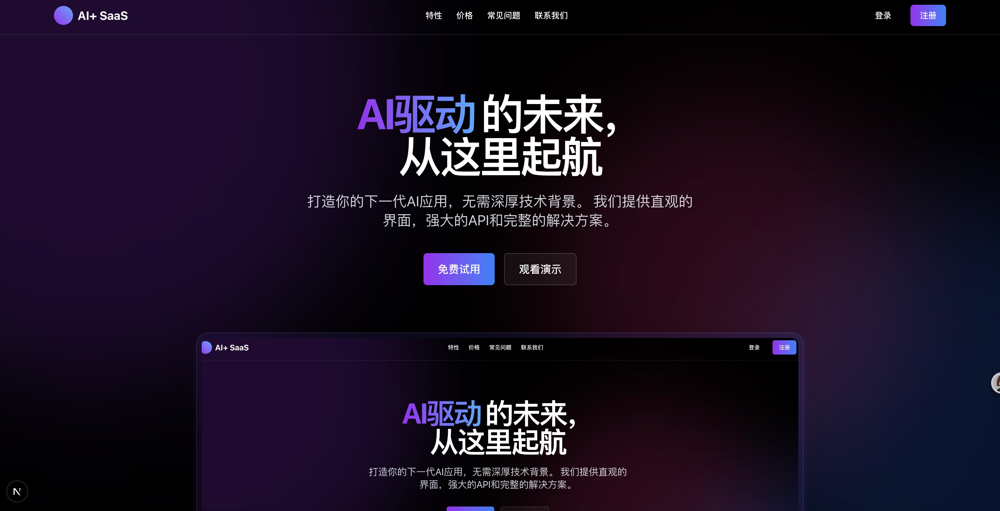
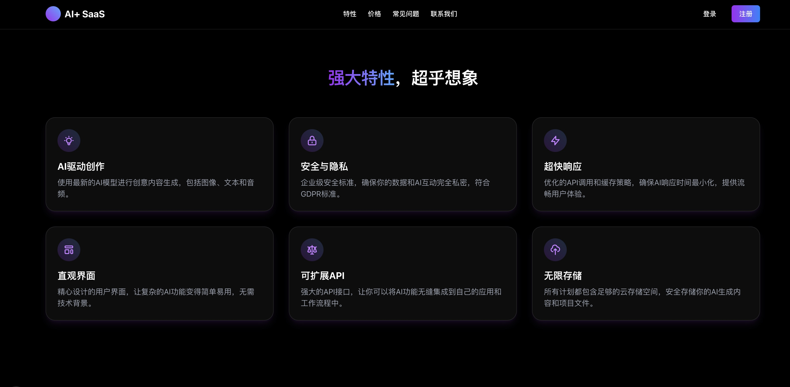
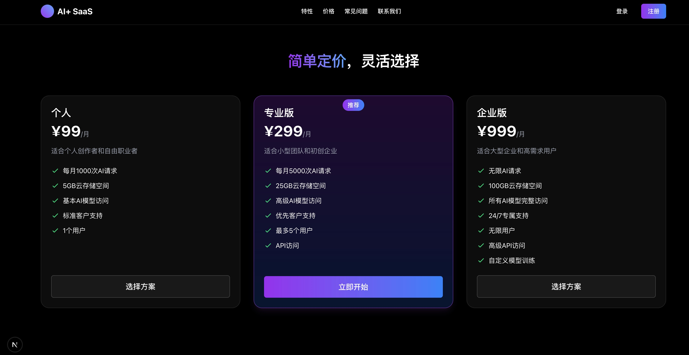
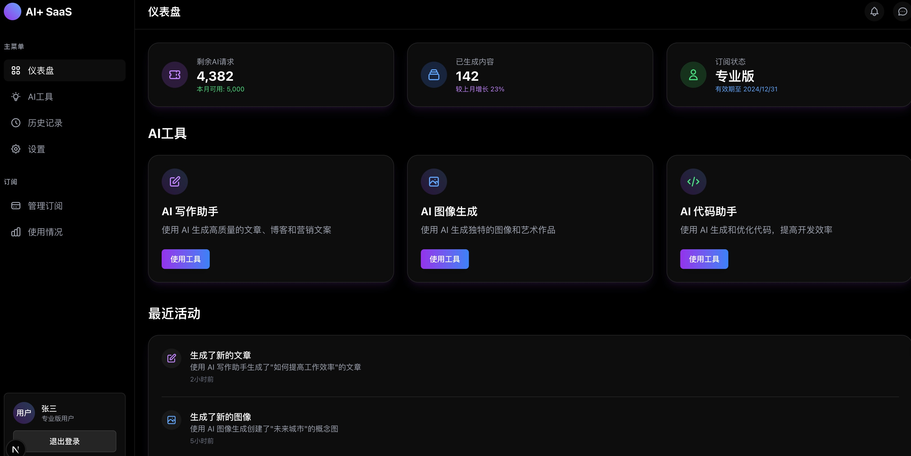

# 用Cursor AI 编程 实现了一个 AI+Saas 模板

 

用Cursor AI 编程 实现了一个 AI+Saas 模板

<!--more-->

# 用Cursor  AI 编程实现了一个 AI+Saas 模板

自己用 cursor 实现了一个 AI+ Saas 模板

先上图

我将分享如何使用 Cursor 创建一个 AI+SaaS 模板。

[GitHub - chenguangwei/saas-template: AI Saas template ，AI Saas 模板。](https://github.com/chenguangwei/saas-template)

## 项目概述

这个项目是一个基于 Next.js 的 SaaS 模板，集成了多种现代技术栈，包括 TypeScript、Tailwind CSS、Prisma ORM 等。它不仅提供了用户认证、支付系统等关键功能，还集成了 AI 图像生成服务。

### 技术栈

- 前端框架: Next.js

- UI 框架: React

- 样式解决方案: Tailwind CSS

- 语言: TypeScript

- 数据库 ORM: Prisma

- 认证系统: Clerk

- 表单处理: React Hook Form + Zod 验证

- 状态管理: Zustand

- 动画: Framer Motion

## 主要功能模块

### 1. 认证系统

使用 Clerk 提供用户认证，支持登录、注册功能，并通过路由保护中间件确保只有已登录用户可访问仪表盘。

### 2. 用户仪表盘

显示用户基本信息，展示用户订阅计划和剩余积分，并提供导航到各 AI 工具、历史记录、设置和订阅管理的入口。

### 3. AI 工具模块

#### 图像生成工具

- 接收用户输入的提示词

- 允许选择图像风格、宽高比和生成数量

- 显示生成的图像结果

- 实时扣除用户积分

### 4. 历史记录模块

动态展示用户的所有 AI 工具使用记录，提供按工具类型、日期筛选功能，支持查看、下载历史生成结果。

### 5. 用户设置模块

提供个人资料设置、界面偏好设置、通知设置和安全设置，设置更改实时保存到数据库。

### 6. 订阅管理模块

显示当前订阅计划详情，提供订阅升级/降级选项，集成 Stripe 支付流程，显示订阅历史和发票记录。

## 数据库交互实现

项目使用 Prisma ORM 定义了多种数据模型，包括用户、图像生成、文本生成、音频处理、用户设置、使用记录和订阅等。

## 扩展点

项目设计为模块化结构，便于未来扩展：

1. 新增 AI 工具：如代码生成工具、3D 模型生成器等。

2. 增强支付功能：多种支付方式集成，灵活的订阅计划管理系统。

3. 用户仪表盘功能：历史记录管理、用户设置面板、订阅管理中心、使用情况分析。

4. API 集成：对接 OpenAI API 实现文本和图像生成。

5. 多语言支持：实现基于 React i18n 的多语言框架。

## 部署考虑

- 使用 MySQL 数据库

- 配置环境变量（DATABASE_URL、Clerk 密钥、Stripe 密钥等）

- 静态资源和生成的图像可存储在云存储服务

- 使用 Vercel 进行部署，实现自动化 CI/CD

- 使用 Redis 缓存提高性能和减少数据库负载

## 结语

希望这篇文章能为你在构建 SaaS 应用时提供一些启发和帮助。

希望这篇博客文章能够帮助到你。

